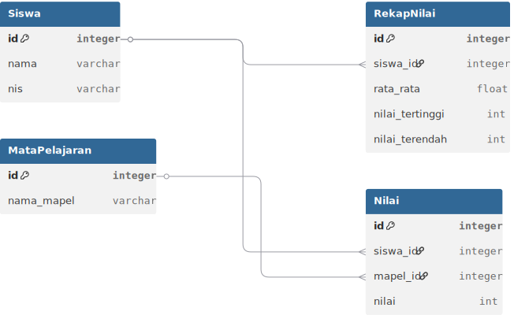

# 📚 Sistem Pengelolaan Nilai Siswa

Sistem ini digunakan untuk mencatat dan mengevaluasi nilai siswa berdasarkan mata pelajaran yang diambil. Sistem menyimpan data seperti nama siswa, NIS, nilai-nilai per mata pelajaran, serta melakukan perhitungan rata-rata, nilai tertinggi, dan nilai terendah.

---

## 📌 Fitur Utama

- Input data siswa (Nama, NIS)  
- Input nilai tiap mata pelajaran  
- Hitung nilai rata-rata, tertinggi, dan terendah  
- Penentuan kelulusan berdasarkan kriteria nilai (≥ 75)  

---

## 👥 Role & Hak Akses

### 👨‍🏫 Guru
- Menginput nilai siswa per mata pelajaran  
- Melihat rekap nilai per siswa & per kelas  
- Melihat hasil evaluasi (rata-rata, tertinggi, terendah)  

### 🧑‍🎓 Siswa
- Melihat nilai pribadi per mata pelajaran  
- Melihat status kelulusan (Lulus/Tidak Lulus)  
- Mengunduh laporan hasil belajar  

### 🛠 Admin
- Mengelola data master (menambah, mengubah, menghapus data siswa & guru)  
- Mengelola daftar mata pelajaran  
- Mengatur kriteria kelulusan (misalnya nilai minimal)  
- Melihat laporan keseluruhan sistem  

---

## 🗂 Struktur Database

📎 Diagram database tersedia pada file:  

---

## 🔁 Flowchart Proses Nilai

Flowchart menggambarkan proses input data, perhitungan nilai, dan keputusan lulus/tidak lulus berdasarkan nilai minimal 75.

📎 Flowchart tersedia pada file:  

---
